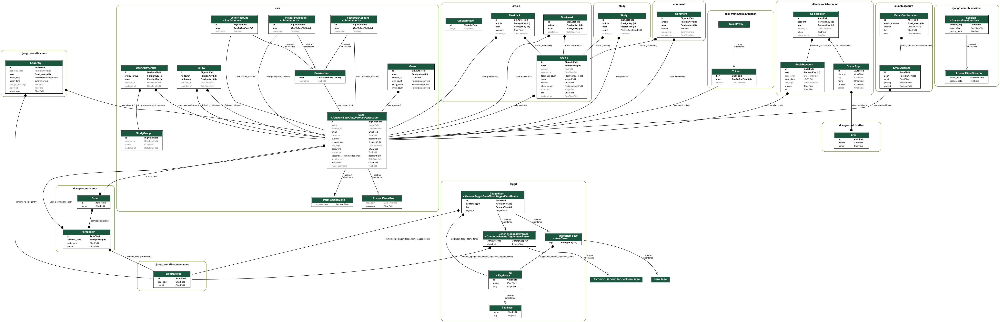
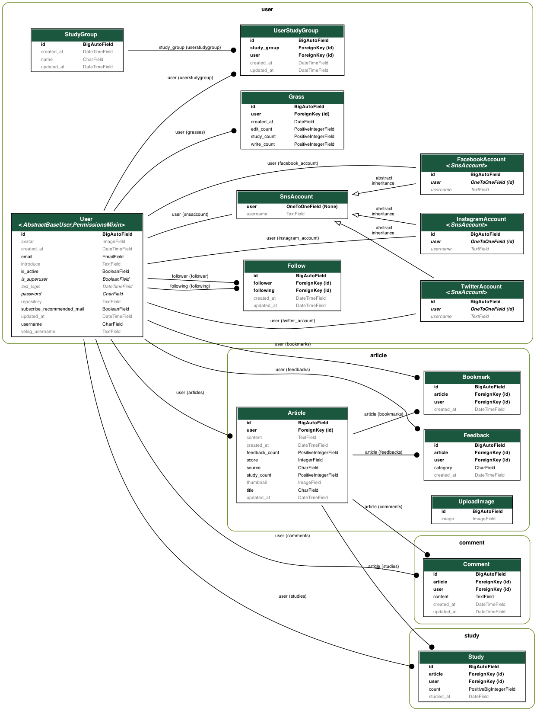

# TTL_API

**목차**
- [서비스 소개](#서비스-소개)
- [서비스 기획 의도](#서비스-기획-의도)
- [메인 기능](#메인-기능)
- [사이트 구조 개요](#사이트-구조-개요)
- [디비 스키마 구조](#디비-스키마-구조)
- [API 구조](#API-구조) 

 

## 서비스 한줄 소개
TIL을 한 곳에서 모아보세요

 

## 서비스 기획 의도

TIL은 `Today I Learned`의 약자로 그날그날 내가 공부한 것을 정리하는 것을 뜻합니다.

주로 Github이나 Tistory, velog 등에 하루하루 본인이 배운 것들을 기록/정리합니다.

TTL`Today They Learned` Github, Tistory, velog 등 다양한 곳에 나눠져 있는 TIL을 모아서 볼 수 있게 만들어주는 서비스입니다.

 

## 메인 기능 

- 다른 곳에서 작성했던 글도 편하게 가져올 수 있습니다.

- 통합/팔로우 피드에서 원하는 TIL을 볼 수 있습니다.

- 다시 보고싶은 TIL을 북마크를 할 수 있습니다.

- TIL에 다양한 이모지를 달 수 있습니다.

- Github, velog을 이용한 TIL 글도 TTL이 알아서 동기화합니다.

- 관심사 혹은 인기있는 TIL이 메일로 발송됩니다.

 

## 사이트 구조 개요

**TTL** 은 프론트엔드와 백엔드가 따로 분리되어 있는 구조입니다.

프론트엔드는 `React.js` 로 개발되었습니다.
백엔드는 `Django` 로 개발되었으며, `django-rest-framework` 를 이용한 API 서버로 구성되어있습니다.

 

## 디비 스키마 구조

### 전체 모델 스키마

### DB 스키마

 

## API 구조

아래 API docs 사이트를 통해 쉽게 확인하실 수 있습니다.
### Swagger
- [Swagger](https://api.todaytheylearn.com/) 

### Redoc
- [Redoc](https://api.todaytheylearn.com/redoc/) 

 

## Links

* [웹사이트](https://todaytheylearn.com/)
* [이슈 트래커](https://github.com/today-they-learned/ttl_api/issues)
* [소스코드](https://github.com/today-they-learned/ttl_api)
