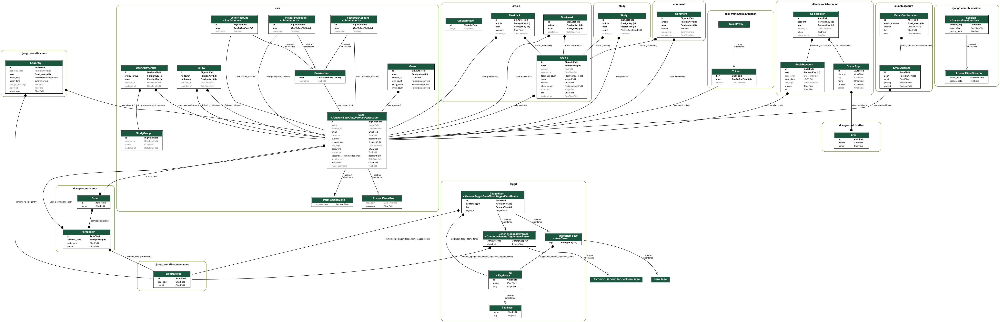
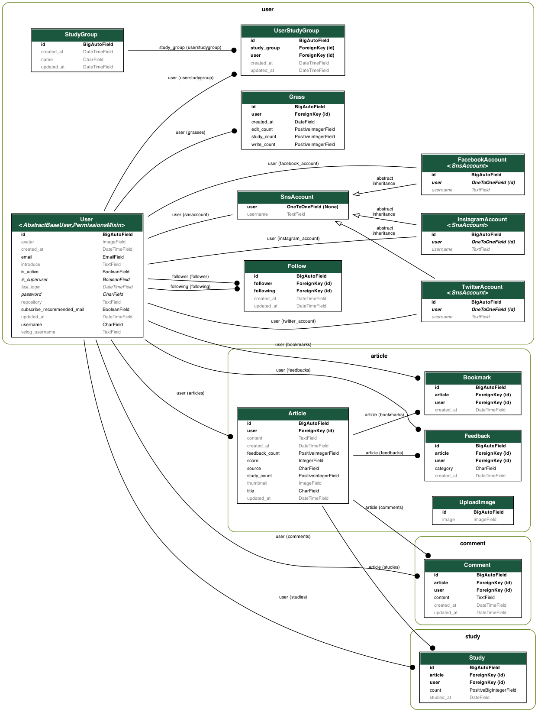
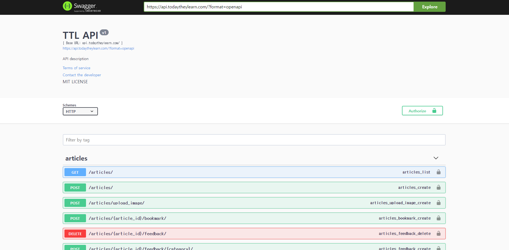
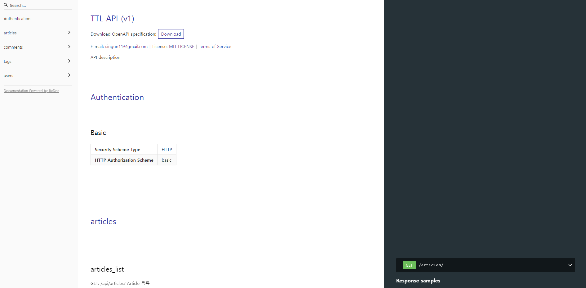

 

    

  <h3>모든 TIL을 한 곳에서 모아보세요. 📚</h3>

  
  
  
	
   
  
	
  

 
 

# TTL_API  

**목차**
- [서비스 소개](#서비스-소개)
- [서비스 기획 의도](#서비스-기획-의도)
- [메인 기능](#메인-기능)
- [사이트 구조 개요](#사이트-구조-개요)
- [디비 스키마 구조](#디비-스키마-구조)
- [API 구조](#API-구조) 

 

## 📝 서비스 기획 의도

😇 TTL은 아래와 같은 분들을 위해 구상된 아이디어로 시작되었습니다.

1️⃣  열심히 개발 공부를 하고, 배운 것을 정리하고 싶은 사자

2️⃣  Github 잔디를 열심히 키우고 있는 사자

3️⃣  블로그 활동을 꾸준히 하려고 하는 사자

 

TIL은 `Today I Learned`의 약자로 그날그날 내가 공부한 것을 정리하는 것을 뜻합니다.

주로 Github이나 Tistory, velog 등에 하루하루 본인이 배운 것들을 기록/정리합니다.

TTL`Today They Learned` Github, Tistory, velog 등 다양한 곳에 나눠져 있는 TIL을 모아서 볼 수 있게 만들어주는 서비스입니다.
또한 TTL에서 글을 작성할 수 있으며 다양한 이모지를 남길 수 있습니다.

 

## 📚 메인 기능 

- 기본적인 **TIL 피드/작성/댓글/북마크** 등의 기능을 제공합니다.

- 기존에 Github 또는 Velog에 **작성한 글을 옮겨오는 기능**을 제공합니다.

- TTL에서 굳이 글을 작성하지 않아도, **Github/Velog에 작성한 글을 주기적으로 동기화하는 기능**을 제공합니다.

- TIL에 **다양한 이모지**를 달 수 있습니다.

 

## 🗃 사이트 구조 개요

**TTL** 은 프론트엔드와 백엔드가 따로 분리되어 있는 구조입니다.

프론트엔드는 `React.js` 로 개발되었습니다.
백엔드는 `Django` 로 개발되었으며, `django-rest-framework` 를 이용한 API 서버로 구성되어있습니다.

 

## 💻 디비 스키마 구조

### 전체 모델 스키마

### DB 스키마

 

## 📡 API 구조

아래 API docs 사이트를 통해 쉽게 확인하실 수 있습니다.
### Swagger
- [Swagger](https://api.todaytheylearn.com/) 

- 

### Redoc
- [Redoc](https://api.todaytheylearn.com/redoc/)

- 

 

## 🔗 Links

* [웹사이트](https://todaytheylearn.com/)
* [이슈 트래커](https://github.com/today-they-learned/ttl_api/issues)
* [소스코드](https://github.com/today-they-learned/ttl_api)

 

## 👥 BACKEND_PEOPLE

| [김신건](https://github.com/shinkeonkim) | [진승희](https://github.com/Jin409) | [최지현](https://github.com/Jihyun-Choi) |
|:--------:|:--------:|:--------:|
||| |

 
